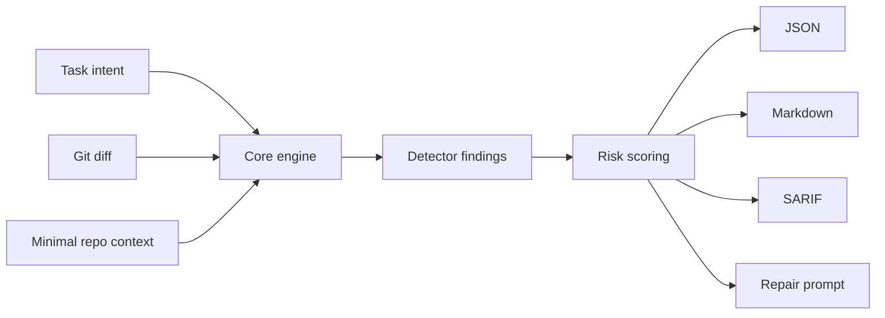

# Architecture

## Recommended Shape

Use one core engine with multiple surfaces:

- CLI first.
- GitHub Action or CI wrapper second.
- VS Code diagnostics extension later.
- Codex hook integration as a wrapper around the CLI.

Avoid separate implementations per surface.

## High-Level Flow

## Inputs

### Task Intent

Can come from:

- CLI `--task`.
- Commit message.
- PR title and body.
- Issue text.
- Codex goal or prompt summary.

The task intent is used to estimate expected scope and identify unrelated changes. For free-text
tasks, explicit constraint clauses are separated from descriptive goal text before lexical intent
analysis; only established deterministic constraints are inferred into contract invariants or
forbidden paths. Structured task contracts remain authoritative.

### Git Diff

The diff is the primary artifact.

The core should normalize:

- Changed files.
- File status: added, modified, deleted, renamed.
- Hunks.
- Added and removed lines.
- Package manifest deltas.
- Test file deltas.
- Config file deltas.
- Export and API surface deltas.

### Minimal Repo Context

Context should be requested by detectors, not loaded globally.

Useful context includes:

- `package.json` and lockfiles.
- Monorepo workspace metadata from `pnpm-workspace.yaml`, package workspaces, `turbo.json`,
  `nx.json`, and `lerna.json`.
- TS config and build config.
- ESLint/test framework config.
- Nearby symbols and exports.
- Existing utility modules.
- Public API reports.
- Public API snapshots in `.critical-gate/api-surface.json`.
- Git co-change history.
- Existing documentation files.

## Core Modules

### Diff Reader

Responsible for baseline resolution and parsing git output into a stable internal model.

### Intent Reader

Normalizes user task, commit message, issue, or PR text into a short intent artifact.

### Context Indexer

Builds focused indexes:

- Workspace files.
- Package manifests.
- Export surfaces.
- Test files.
- Config files.
- Symbol names.
- Git history co-change graph.

The indexer should be lazy where possible.

### Detector Runner

Runs detectors over the diff and requested context. Detectors return normalized findings with
evidence, evidence strength, severity, and repair hints. The legacy JSON field is still named
`confidence` for compatibility, but current values should be treated as heuristic evidence strength,
not calibrated probability.

### Risk Scorer

Combines findings into:

- Per-finding severity.
- Diff Cost Score.
- Overall gate decision.

### Reporter

Writes:

- JSON for machines.
- Markdown for humans.
- SARIF for code scanning tools.
- Compact repair instructions for Codex hooks.

## Finding Model

Each finding should include:

- `id`: stable detector finding id.
- `detector`: detector name.
- `severity`: `blocker`, `high`, `medium`, `low`, or `info`.
- `confidence`: legacy compatibility field for heuristic evidence strength, from 0 to 1.
- `evidenceStrength`: preferred compatibility-safe field for the same heuristic score.
- `title`: short human label.
- `message`: concise explanation.
- `evidence`: file paths, line ranges, symbols, manifest keys, or metrics.
- `repair`: minimal recommended action.
- `tags`: categories such as `scope`, `dependency`, `api`, `test`, `secret`, `config`.

## Output Contracts

### JSON

Primary integration format. It must be stable and versioned.

### Markdown

Human summary for local CLI, PR comments, and agent handoff.

### SARIF

Interoperability format for code scanning and review systems.

### Editor Diagnostics

Editor surfaces should consume existing `GateResult` findings and map them into file diagnostics.
They should not re-run detector logic or create editor-only findings.

## LLM Usage Boundary

Use an LLM only after deterministic detectors produce a compact artifact.

Good model input:

- Task summary.
- Changed file list.
- Diff metrics.
- Detector findings.
- Relevant nearby context snippets.

Bad model input:

- Whole repository.
- Whole PR without prior filtering.
- Unbounded dependency trees.

Model usage should be optional, cacheable, and disabled by default in CI until deterministic quality is strong.

The optional implementation boundary lives in `src/llm`. It exposes a compact model artifact,
redaction helpers, prompt construction, provider interface, cache, and budget controls without
bundling a model provider.
